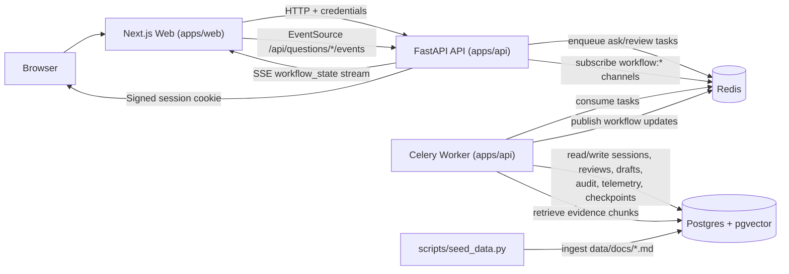
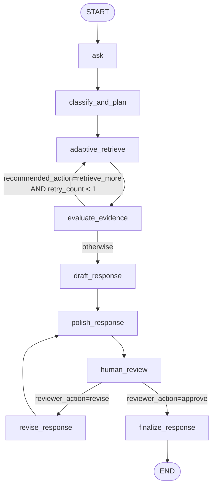

# Respond AI

Workflow-first RFP/DDQ drafting system with evidence retrieval, human review gates, and auditable finalization.

## Executive Summary

Respond AI is a monorepo with:

- `apps/api`: FastAPI + LangGraph + Celery worker runtime
- `apps/web`: Next.js reviewer UI
- `postgres` + `pgvector`: document, workflow, and audit storage
- `redis`: Celery broker/result backend and SSE event fanout

The workflow is not chat-style freeform. It is an explicit graph with a human review interrupt, revision loop, and approval finalization.

## Architecture Overview



## AI Workflow Graph



Implementation notes:

- `human_review` is a LangGraph interrupt; resume is triggered by `POST /api/questions/{session_id}/review`.
- Retrieval retry is bounded to one extra retrieval pass (`retry_count < 1`).
- Approval writes immutable final audit metadata and locks further review actions for that session.

## Realtime Workflow Updates (SSE)

- Ask flow starts with `POST /api/questions/ask` (returns quickly after queueing Celery task).
- Web subscribes to `GET /api/questions/thread/{thread_id}/events` during bootstrap, then to `GET /api/questions/{session_id}/events`.
- Worker publishes lifecycle events to Redis pub/sub; API streams enriched session snapshots over SSE.
- No polling path is used by the current web workflow.

## Key Features

- Structured retrieval planning and adaptive evidence retrieval
- Evidence evaluation before drafting
- Human review gate with approve/revise branching
- Draft version history and draft-to-draft diff endpoints
- Evidence exclusion controls in revision flow
- Evidence-gap acknowledgement gate before approval
- Immutable final audit snapshot (`GET /api/questions/{session_id}/audit`)
- Alembic-managed schema with startup revision checks

## Prerequisites

- Docker + Docker Compose
- Optional local runtime tools:
  - Python 3.11+ and `uv`
  - Bun 1.x

## Environment Configuration

Copy:

```bash
cp .env.example .env
```

### Core Runtime

- `DATABASE_URL`
- `APP_REDIS_URL`
- `APP_CELERY_BROKER_URL`
- `APP_CELERY_RESULT_BACKEND`
- `APP_SESSION_SECRET`
- `APP_WEB_ORIGIN`
- `NEXT_PUBLIC_API_BASE_URL` (web -> API base URL)

### AI Provider Configuration

The API validates AI config at startup (`validate_ai_configuration()`), so missing required keys fail startup.

- Defaults use OpenAI for large/small chat + embeddings:
  - `AI_PROVIDER=openai`
  - `LARGE_LLM_PROVIDER=openai`
  - `SMALL_LLM_PROVIDER=openai`
  - `EMBEDDING_PROVIDER=openai`
  - Requires `OPENAI_API_KEY`
- If using Anthropic for chat, embeddings must still use OpenAI or Google.
- `EMBEDDING_PROVIDER=anthropic` is unsupported.
- If `ENABLE_LLM_JUDGE_EVALS=true`, configure `EVAL_LLM_MODEL` (and provider key for `EVAL_LLM_PROVIDER`).

### Auth / Session

- `APP_DEMO_USERNAME`
- `APP_DEMO_PASSWORD`
- `APP_SESSION_SECRET`
- `APP_ENV` (`production` enables secure session cookie flag)

### Optional Tuning

- `LOGGING_LEVEL`
- `RETRIEVAL_TOP_K`
- `FINAL_EVIDENCE_K`
- `AI_TEMPERATURE`
- `AI_MAX_RETRIES`
- `AI_TIMEOUT_SECONDS`
- `MODEL_PRICING_JSON`

Note: Docker Compose injects variables listed in `docker-compose.yml` into `api`/`worker`. If you want `APP_ENV` or `MODEL_PRICING_JSON` inside Docker containers, add them to those service `environment` blocks.

## Docker Setup

### First-Time Bootstrap (Fresh DB)

`api` startup checks Alembic head and will fail if migrations were not applied yet. Use this order:

Set required provider API keys in `.env` before running seed/migrations.

```bash
cp .env.example .env
docker compose build api worker web
docker compose up -d postgres redis
docker compose run --rm api uv run alembic upgrade head
docker compose run --rm api uv run python scripts/seed_data.py
docker compose up -d api worker web
```

Verify:

- Web: http://localhost:3000
- API: http://localhost:8000
- Health: http://localhost:8000/health

### Normal Restart

```bash
docker compose up -d
```

If migrations changed and `api` is already running:

```bash
docker compose exec -T api uv run alembic upgrade head
```

If `api` is not running yet, use:

```bash
docker compose run --rm api uv run alembic upgrade head
```

## Local Dev (Without Dockerized API/Web)

If you run API on host, set `DATABASE_URL` to a host-reachable DB (for example `localhost`, not `postgres`).

```bash
docker compose up -d postgres redis
cd apps/api && uv sync --extra dev
cd apps/api && uv run alembic upgrade head
cd apps/api && uv run python scripts/seed_data.py
cd apps/api && uv run uvicorn app.main:app --reload
cd apps/api && uv run celery -A app.core.celery_app.celery_app worker --loglevel=INFO
cd apps/web && bun install --frozen-lockfile
cd apps/web && bun run dev
```

## Database Migrations and Seeding

### Apply Migrations

```bash
docker compose exec -T api uv run alembic upgrade head
```

### Create Migration

```bash
docker compose exec -T api uv run alembic revision --autogenerate -m "describe change"
```

### Seed Documents

```bash
docker compose exec -T api uv run python scripts/seed_data.py
```

Seed behavior:

- Reads markdown from `data/docs/*.md`
- Replaces previously-seeded rows by filename (safe to rerun)
- Requires migrations to be current before it runs
- Not required for auth/login, but required for meaningful retrieval-backed answers

### Schema Change Workflow

1. Update SQLAlchemy models in `apps/api/app/db/models.py`.
2. Generate migration.
3. Review generated migration file in `apps/api/alembic/versions/`.
4. Apply migration.
5. Rerun seed if source docs changed.

## Authentication and Access

- Login: `POST /auth/login`
- Logout: `POST /auth/logout`
- Current user: `GET /auth/me`
- Default demo credentials:
  - username: `admin`
  - password: `admin1234`

Protected routers require authenticated session cookie:

- `/api/questions/*`
- `/api/documents`
- `/api/evals/*`

Public endpoints:

- `/health`
- `/auth/*`

CORS is allowlist-based from `APP_WEB_ORIGIN` (credentials enabled); wildcard origin is not used.

## Useful Commands

```bash
# Start / rebuild
docker compose up -d
docker compose up -d --build

# Logs
docker compose logs -f api
docker compose logs -f worker
docker compose logs -f web

# DB + seed
docker compose exec -T api uv run alembic current
docker compose exec -T api uv run alembic upgrade head
docker compose exec -T api uv run python scripts/seed_data.py

# Evals
docker compose exec -T api uv run python scripts/run_evals.py --limit 50

# Health
curl -s http://localhost:8000/health

# Stop
docker compose down
```

## Design Decisions

- SSE over polling/websockets for server-to-client workflow state streaming.
- Celery to decouple long-running graph execution from API request latency.
- Redis as both Celery transport and cross-process workflow event fanout.
- Alembic revision checks at startup to prevent running against stale schema.

## Current Limitations

- Demo auth only (single credential pair from env, no RBAC/IdP).
- Redis pub/sub event fanout is ephemeral, not durable replay.
- Planner node is fail-fast: if retrieval planning model is unavailable, ask workflow fails.
- Seed pipeline ingests local markdown files only.
- Web test script currently runs build-only checks (no dedicated UI test suite).

## Summary

This repository is a workflow-governed AI drafting system with explicit state transitions, human approval control, and auditable finalization. The setup steps above mirror the current runtime behavior, including migration-first startup and SSE-driven progress updates.
